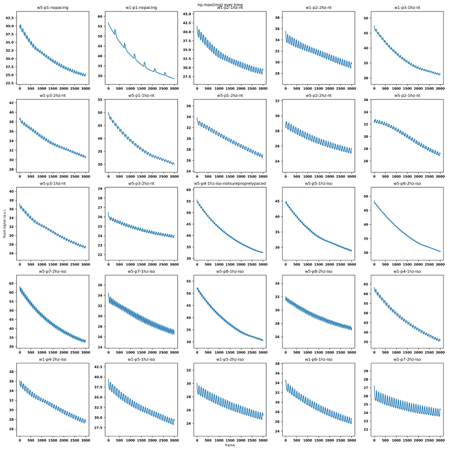

# Brief explanation

This repository contains some python files that I used for a pilot analysis
to quantify beating and contractility in IPS-CMs using microscopy data 
(ie movies of beating IPS-CMs with high acquisition rate).

Currently, many project files reside in the ./dev directory, as this repository
is under development.

_(Update 2024/03.)_ I now moved most of the actual analysis code to functions,
and there's an example on how to run this pipeline in the `main_analysis_example.py`
file.

# Work in progress

## Assessing calcium 

I also wrote preliminary scripts to process data coming from measurement using the calcium dye "Fluo4".

This script is not very well organized yet, but can be found here:
`cardio_img_analysis/dev/first_trial_contractility_fluo4.py`.

These signals were a little bit hard to analyze due to a high background signal and overall decay of the signal. (To do: check whether the signal can be improved in our setup, as we used plastic well plates.)

See for example:

_Picture from sample data 2022.12.16_Fluo4_test._

In the end I used a more complicated procedure, where I used only the middle of the microscopy image to determine the signal, I first estimated the interpeak time using the autocorrelation function, and then used a peak finder on the negative trace in which I required that the inter-peak distance is at least 60% of the peak time estimated from the autocorrelation. I then fitted a negative decay using a 3-rd degree polynomial function, and used that for normalization.

This procedure could be further improved by estimating the background signal from a spot where there are no cells (if this is available, which isn't always the case).

# See also 
For lab members, see also the elab journal, where I stored notes about this project.
